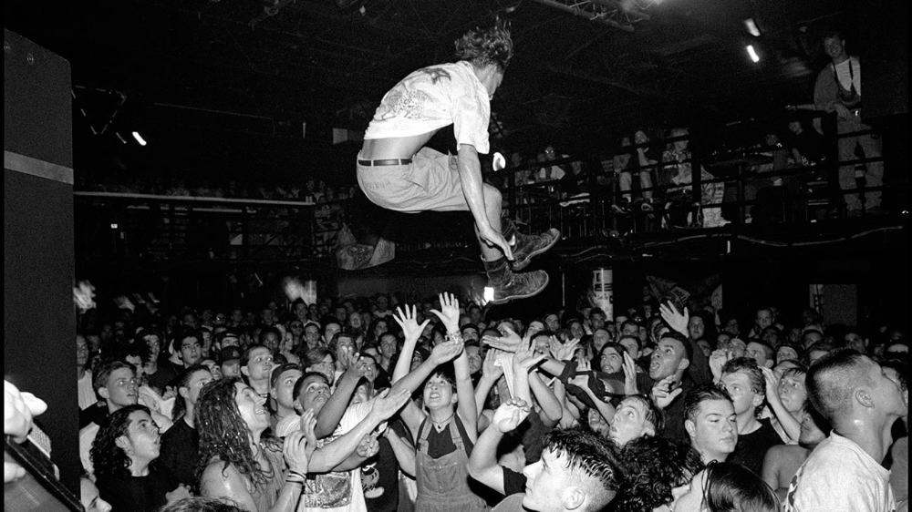

# Teodora Tsvikina
<i> Results-oriented professional with experience in organizing and coordinating diverse projects. I combine an analytical mindset with a creative background and excel in structuring processes, leading teams, and managing deadlines. I am currently pursuing a data engineering course to further enhance my technical expertise. I have experience setting up and guiding multidisciplinary projects, ensuring efficient planning, clear communication, and smooth collaboration among various stakeholders. I thrive in environments that prioritize creativity, sustainability, and social impact. Outside of work, I am active in music and the arts and have a broad interest in writing, performance, and culture. I enjoy long walks, adventures with my son, and continuously learning about a wide range of topics-from mathematics to spirituality</i>

---

## Skills

- **Programming Languages**: Python (Pandas, NumPy, Matplotlib, Seaborn)
- **Databases**: SQL (MySQL, T-SQL)
- **Data Visualization**: Power BI, Tableau, Matplotlib
- **Tools & Technologies**: Azure, Git, Jupyter Notebooks
- **Data Analytics**: Data cleaning, Data manipulation, Statistical analysis
- **Project Management**: Agile/Scrum
- **Soft Skills**: Analytical thinking, Problem-solving, Attention to detail, Creative thinking

## Education						       		

**Business Intelligence and Data Analysis**  
Bit Academy (_March 2024_)  
Relevant coursework: Data Warehousing, Data Mining, SQL for Data Analysis, Data Visualization

**Big Data Analysis**  
Markus Verbeek Praehep (_April 2023_)  
Relevant coursework: Big Data Technologies, Hadoop, Spark, Data Integration, Data Quality

**B.S., International Music Management**  
Inholland University of Applied Sciences (_June 2022_)  
Relevant coursework: Market Research, Data Analysis in the Music Industry, Statistics for Business, Advanced Excel

## Currently Enrolled

**Data Engineering course**  
Bit Academy (_September 2024_)  
Relevant coursework: Python, Microsoft Azure, HTML, Data Governance and Compliance, Cloud Storage, Cloud Visualizations, Cloud Data Security

## Work Experience
**Data Management Specialist @ Het Poortgebouw Association (_June 2022 - Present_)**
- Digitalized the association’s archive, enhancing data accessibility and organization.
- Utilized Python for data cleaning and preprocessing.
- Developed and maintained a searchable database using SQL.
- Created data visualizations and reports using Power BI to support decision-making.

**Music Manager & Event Organizer @ Teodora Tsvikina (_October 2019 - Present_)**
- During 2020 and 2021 worked on a research about the significance of underground DIY music spaces on the social capital creation in cities.
- Organizing multi-disciplinary events and concerts with international and local (music) acts.
- Offering creative and business advice to artists.

**MTV Content Coordinator @ VIACOM (_February 2017 - January 2019_)**
- Ensured content, localization, and metadata are delivered in time and on spec for flawless publishing on the clients’ platform (linear and non-linear).
- Entering and checking (meta)data availability and consistency throughout all databases.
- Monitoring the processing of content using various systems (e.g. WON, Sensei, FLOW/Orchestrator)
- The main point of contact between the local MTV Italy, MTV Germany, MTV Japan, and Vh1 Japan offices, localization companies and production companies from England and USA.

## Projects

### Impact of DIY Music Spaces on Local Communities

**Project Overview** : This project investigates the role of DIY music spaces in fostering community engagement, cultural exchange, and local economic development. The analysis uses randomly generated survey data to demonstrate the methodology and techniques employed.

[Project files](DIY-spaces-and-local-communities)

[Publication](https://www.m)

